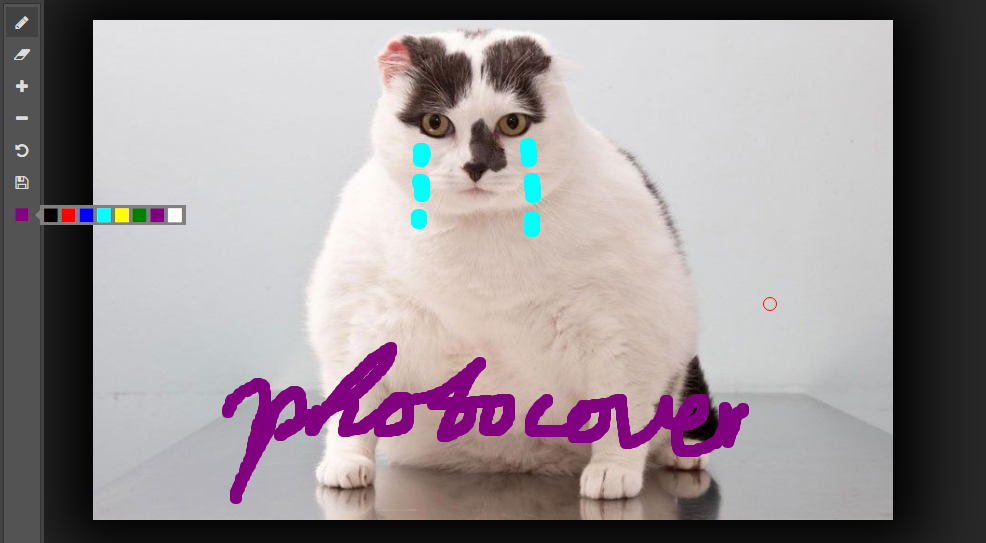

# PhotoCover


## Demo
https://wuyuchang.github.io/PhotoCover/demo/photoshop


## Features
- Draw
- Eraser
- add radius of pen or eraser
- reduce radius of pen or eraser
- undo
- generate dataurl

## Installing
``` shell
$ bower install photocover
```

## Example

``` javascript
// Initial
window.onload = function () {
  var draw = new PhotoCover('#img')

  // set tool as eraser
  document.querySelector('#setEraser').onclick = function () {
    draw.setEraser()
  }
}
```


## API

### initial
**new PhotoCover(selector)**
``` javascript
// initial photocover
var draw = new PhotoCover('#img')
```

### mouse tool
**pen**
draw.setPen()

**eraser**
draw.setEraser()


### change radius of mouse tool
**zoomIn**
draw.zoomIn()

**zoomOut**
draw.zoomOut()

### undo
**undo**
draw.undo()


### dataurl
**dataurl**
draw.getDataURL()
