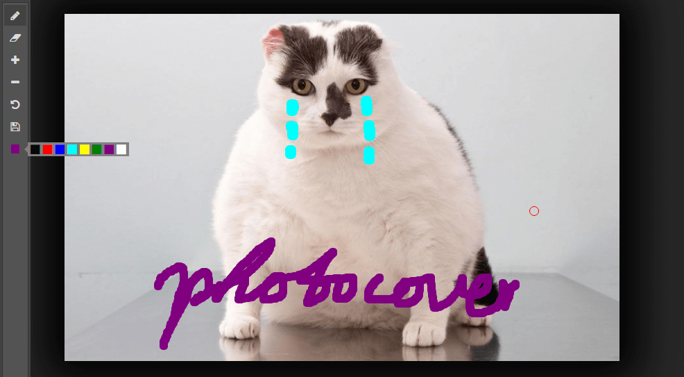

# PhotoCover


## Demo
https://wuyuchang.github.io/PhotoCover/demo/photoshop


## Description
PhotoCover is a small libray which paint on image, it's only 2kb on gzip.
You can undo if paint mistake, and it's more performance, minimal memory usage, because it's base on operate history, but not image data.

## Features
- Draw
- Eraser
- add radius of pen or eraser
- reduce radius of pen or eraser
- undo
- generate dataurl

## Installing
``` shell
$ bower install photocover
```

## Example

``` javascript
// Initial
window.onload = function () {
  var draw = new PhotoCover('#img')

  // set tool as eraser
  document.querySelector('#setEraser').onclick = function () {
    draw.setEraser()
  }
}
```


## API

### initial
##### new PhotoCover(selector)
``` javascript
// initial photocover
var draw = new PhotoCover('#img')
```

### mouse tool
##### pen
draw.setPen()

##### eraser
draw.setEraser()


### change radius of mouse tool
##### zoomIn
draw.zoomIn([radius: number])

radius: how much radius you want to add

##### zoomOut
draw.zoomOut([radius: number])

radius: how much radius you want to minus

### undo
##### undo
draw.undo()


### dataurl
##### dataurl
draw.getDataURL([type: string, [quality: number, [callback: Function]]])

type: same as [HTMLCanvasElement.toDataURL()](https://developer.mozilla.org/en-US/docs/Web/API/HTMLCanvasElement/toDataURL)

quality: same as encoderOptions in [HTMLCanvasElement.toDataURL()](https://developer.mozilla.org/en-US/docs/Web/API/HTMLCanvasElement/toDataURL)
